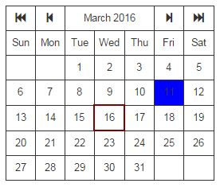

# Calendar Store Service

**A JavaScript store service - provides data store for Calendar widgets/components**

>Can be used with JavaScript frameworks (like AngularJs, ReactJs, ReactJs + Redux, etc) to create Calendar widgets (as shown below).

>

>This project includes examples.

## License

MIT
